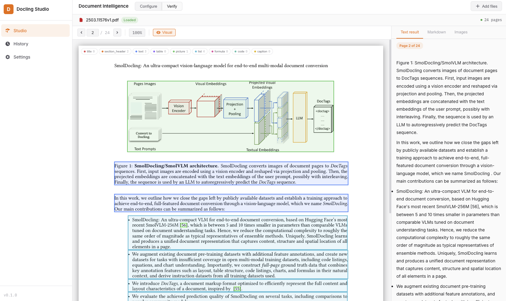
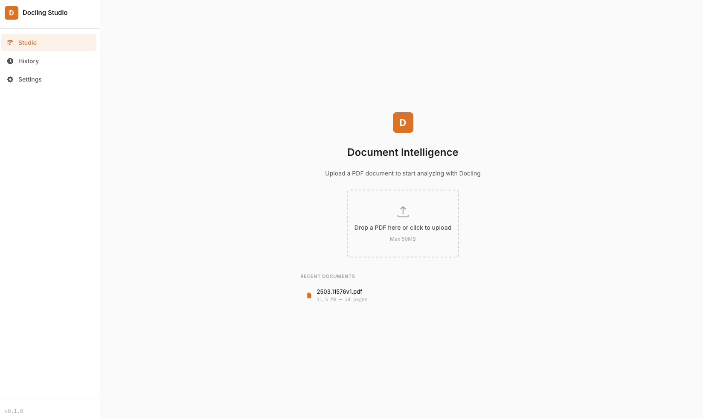
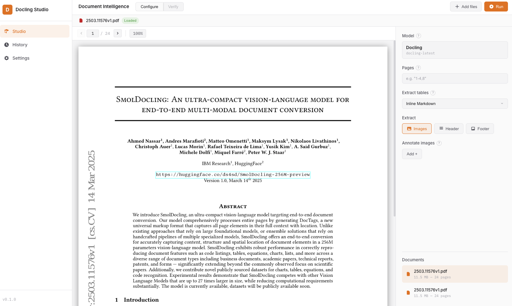

# Docling Studio


A visual document analysis studio powered by [Docling](https://github.com/DS4SD/docling).
Upload a PDF, configure the extraction pipeline, and visualize the results — text, tables, images, formulas, bounding boxes — all from your browser.



## Features

- **PDF viewer** with page navigation and visual overlay toggle
- **Configurable Docling pipeline** — OCR on/off, table extraction mode (fast/accurate)
- **Bounding box visualization** — overlay extracted elements directly on the PDF with color-coded types
- **Per-page results** — right panel syncs with the current PDF page
- **Document hierarchy** — heading levels and structure preserved from Docling's `iterate_items()` API
- **Markdown & HTML export** of extracted content
- **Analysis history** — re-visit past analyses

<details>
<summary>More screenshots</summary>

| Import | Configure | Results |
|--------|-----------|---------|
|  |  |  |

</details>

## Architecture

```
┌────────────┐         ┌───────────────────────┐
│  Frontend   │────────▶│   Document Parser      │
│  Vue 3      │  /api/* │ FastAPI + Docling       │
│  port 3000  │         │ SQLite + file storage   │
└────────────┘         │   port 8000             │
                        └───────────────────────┘
```

| Service | Stack | Role |
|---------|-------|------|
| **frontend** | Vue 3, Vite, Pinia | UI, PDF viewer, results display |
| **document-parser** | FastAPI, Docling, SQLite, pdf2image | REST API, document parsing, storage, persistence |

### Python project structure (clean architecture)

```
document-parser/
├── main.py                   # FastAPI app, CORS, lifespan
├── domain/                   # Pure domain models & Docling logic
│   ├── models.py             # Document, AnalysisJob dataclasses
│   └── parsing.py            # Docling conversion & page extraction
├── api/                      # HTTP layer (FastAPI routers)
│   ├── schemas.py            # Pydantic DTOs (camelCase serialization)
│   ├── documents.py          # /api/documents endpoints
│   └── analyses.py           # /api/analyses endpoints
├── persistence/              # Data layer (SQLite)
│   ├── database.py           # Connection management, schema init
│   ├── document_repo.py      # Document CRUD
│   └── analysis_repo.py      # AnalysisJob CRUD
└── services/                 # Use case orchestration
    ├── document_service.py   # Upload, delete, preview
    └── analysis_service.py   # Async Docling processing
```

## Quick Start

### Docker Compose (recommended)

```bash
# Clone the repo
git clone https://github.com/scub-france/docling-studio.git
cd docling-studio

# (Optional) customize settings
cp .env.example .env

# Start all services
docker compose up --build
```

Open [http://localhost:3000](http://localhost:3000)

> **Note:** The first analysis takes a bit longer as Docling downloads and caches its ML models (~400 MB). Subsequent runs are fast.

### Local Development

**Document Parser** (Python 3.12+):
```bash
cd document-parser
python -m venv .venv && source .venv/bin/activate
pip install -r requirements.txt
uvicorn main:app --reload --port 8000
```

**Frontend** (Node 20+):
```bash
cd frontend
npm install
npm run dev
```

## Docling Integration

The document parser wraps [Docling](https://github.com/DS4SD/docling) with configurable pipeline options exposed as query parameters on the `/parse` endpoint:

| Parameter | Default | Description |
|-----------|---------|-------------|
| `do_ocr` | `true` | Enable OCR for scanned documents |
| `do_table_structure` | `true` | Enable table structure extraction |
| `table_mode` | `accurate` | Table extraction mode: `accurate` or `fast` |

Element types are detected using `isinstance()` checks against Docling's type hierarchy (`TextItem`, `TableItem`, `PictureItem`, `SectionHeaderItem`, etc.) and the document tree depth from `iterate_items()` is preserved for heading-level reconstruction.

## Configuration

All configuration is done via environment variables. See [`.env.example`](.env.example) for available options.

| Variable | Default | Description |
|----------|---------|-------------|
| `CORS_ORIGINS` | `http://localhost:3000,...` | CORS allowed origins (comma-separated) |
| `UPLOAD_DIR` | `./uploads` | File storage directory |
| `DB_PATH` | `./data/docling_studio.db` | SQLite database path |

## Performance & System Requirements

Docling leverages optimized ML models (layout analysis, OCR, table structure) that run efficiently on CPU. The first analysis takes slightly longer as models are downloaded and cached (~400 MB). Subsequent runs are fast, even on large documents.

| Document type | Pages | Approx. time (CPU) |
|---------------|-------|---------------------|
| Simple report | 5-10  | ~30s-1 min |
| Research paper | 10-30 | ~1-2 min |
| Large document | 100+  | ~2-5 min |

### Docker Desktop settings

The document parser needs **at least 4 GB of RAM**. Recommended Docker Desktop allocation:

| Resource | Minimum | Recommended |
|----------|---------|-------------|
| Memory   | 6 GB    | 8 GB+       |
| CPUs     | 4       | 8+          |

> On **macOS**: Docker Desktop > Settings > Resources
> On **Windows**: Docker Desktop > Settings > Resources > WSL 2

### Platform support

All Docker images are **multi-arch** (linux/amd64 + linux/arm64). All processing runs on **CPU** — no GPU required.

| Platform | Architecture |
|----------|-------------|
| **macOS Apple Silicon** (M1/M2/M3/M4) | arm64 |
| **macOS Intel** | amd64 |
| **Linux x86_64** | amd64 |
| **Linux ARM** (Raspberry Pi 5, Ampere) | arm64 |
| **Windows + WSL2** | amd64 |

## Tech Stack

- **Frontend**: Vue 3 + Vite + Pinia
- **Backend**: FastAPI + Docling 2.x + SQLite + pdf2image
- **Infra**: Docker Compose + Nginx

## Contributing

Contributions are welcome! Please open an issue first to discuss what you'd like to change.

## License

[MIT](LICENSE) — Pier-Jean Malandrino
