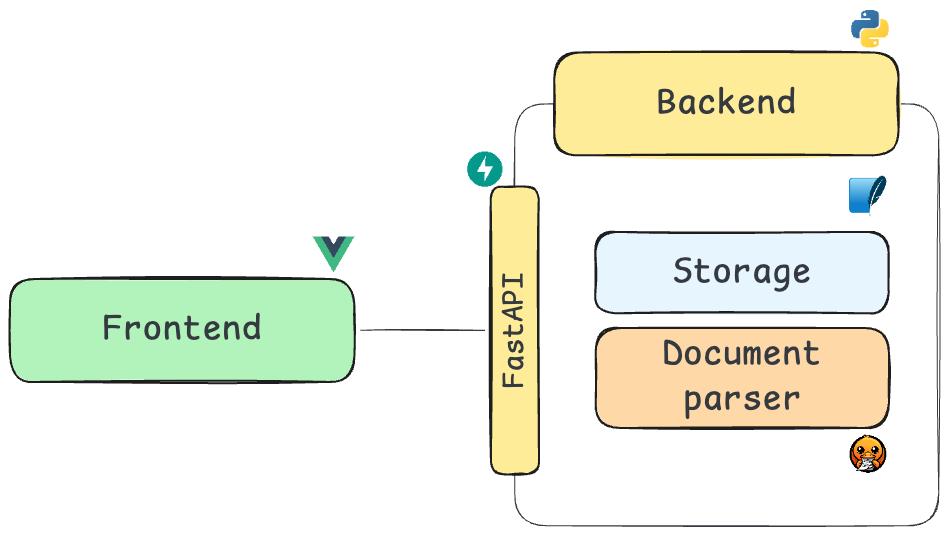

# Architecture

## Overview

{ width="700" }

Two services communicating via REST. The frontend is a Vue 3 SPA served by Nginx in production. The backend is a FastAPI app that wraps Docling's document conversion engine.

### Zooming into the backend

The schema above shows the macro view. Inside the backend, the code follows a **Clean Architecture** with strict layer boundaries:

```
┌──────────────────────────────────────────────────────┐
│                     Backend                           │
│                                                      │
│   ┌──────────┐                                       │
│   │   api/   │  ← HTTP (FastAPI routes, Pydantic)    │
│   └────┬─────┘                                       │
│        │ calls                                       │
│   ┌────▼─────┐                                       │
│   │services/ │  ← Use case orchestration             │
│   └──┬────┬──┘                                       │
│      │    │                                          │
│  ┌───▼──┐ ┌▼───────────┐                             │
│  │domain│ │persistence/ │                             │
│  │      │ │             │                             │
│  │bbox  │ │ SQLite CRUD │  ← Storage (your blue box) │
│  │parse │ │ file store  │                             │
│  └──────┘ └─────────────┘                             │
│  ↑ pure Python, no deps   ↑ aiosqlite               │
└──────────────────────────────────────────────────────┘
```

Dependencies flow **inward**: `api → services → domain`. The domain layer has zero knowledge of HTTP or database.

## Backend — Clean Architecture

The backend follows a strict layered architecture. Dependencies flow inward: API → Services → Domain. The domain layer has zero knowledge of HTTP or database.

```
document-parser/
├── main.py                   # FastAPI app, CORS, lifespan
│
├── domain/                   # Pure domain — no HTTP, no DB
│   ├── models.py             # Document, AnalysisJob dataclasses
│   ├── parsing.py            # Docling conversion & page extraction
│   └── bbox.py               # Bounding box coordinate normalization
│
├── api/                      # HTTP layer (FastAPI routers)
│   ├── schemas.py            # Pydantic DTOs (camelCase serialization)
│   ├── documents.py          # /api/documents endpoints
│   └── analyses.py           # /api/analyses endpoints
│
├── persistence/              # Data layer (SQLite via aiosqlite)
│   ├── database.py           # Connection management, schema init
│   ├── document_repo.py      # Document CRUD
│   └── analysis_repo.py      # AnalysisJob CRUD
│
├── services/                 # Use case orchestration
│   ├── document_service.py   # Upload, delete, preview
│   └── analysis_service.py   # Async Docling processing
│
└── tests/                    # pytest
```

### Layer responsibilities

| Layer | Role | Depends on |
|-------|------|------------|
| **domain** | Dataclasses, value objects, ports | Nothing (pure Python) |
| **persistence** | SQLite CRUD, aiosqlite | domain (models) |
| **services** | Orchestrate use cases, call Docling | domain + persistence |
| **api** | HTTP endpoints, Pydantic DTOs, error handling | services |

### API contract

The API uses **camelCase** serialization (via Pydantic `alias_generator`), while the backend uses **snake_case** internally. The `pages_json` field contains raw `dataclasses.asdict()` output, so page data uses **snake_case** (`page_number`, not `pageNumber`).

## Frontend — Feature-Based

The frontend is organized by feature, each with its own store, API client, and UI components.

```
frontend/src/
├── app/                      # App shell, router, global styles
├── pages/                    # Route-level pages
│   ├── HomePage.vue
│   ├── StudioPage.vue        # PDF viewer + config + results
│   ├── DocumentsPage.vue
│   ├── HistoryPage.vue
│   └── SettingsPage.vue
│
├── features/                 # Feature modules
│   ├── analysis/             # Analysis store, API, bbox scaling, UI
│   │   ├── store.ts
│   │   ├── api.ts
│   │   ├── bboxScaling.ts    # Pure math: page coords → pixel coords
│   │   └── ui/
│   │       ├── BboxOverlay.vue
│   │       ├── AnalysisPanel.vue
│   │       ├── StructureViewer.vue
│   │       └── ...
│   ├── document/             # Document store, API, upload
│   ├── history/              # History store, navigation
│   └── settings/             # Theme, locale, API URL
│
└── shared/                   # Cross-feature utilities
    ├── types.ts              # All shared TypeScript interfaces
    ├── i18n.ts               # FR/EN translations
    ├── format.ts             # Date/size formatters
    └── api/http.ts           # HTTP client (fetch wrapper)
```

### Data flow

```
User action → Pinia store action → API client (fetch) → Backend REST endpoint
                                                              │
Backend response → Pinia store state → Vue reactivity → UI update
```

### Key design decisions

- **Pinia stores** per feature, not global. Each feature owns its state.
- **TypeScript strict mode** with shared interfaces in `shared/types.ts`.
- **No component library** — custom CSS with CSS variables for theming.
- **vue-tsc** in CI to catch type errors before merge.
