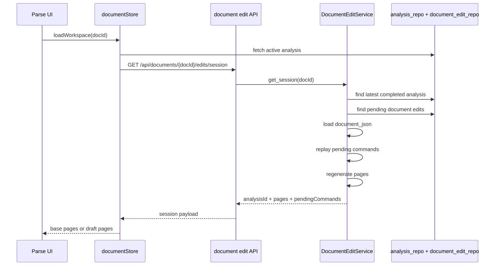
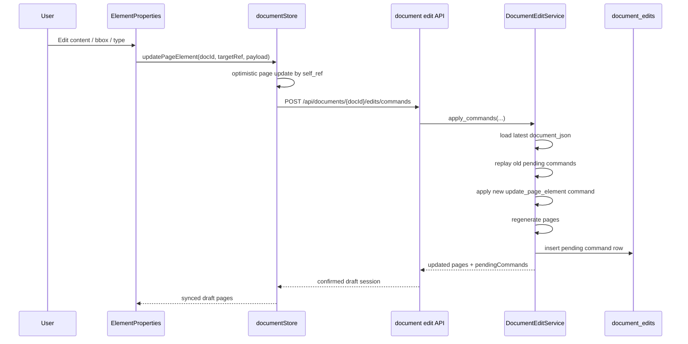
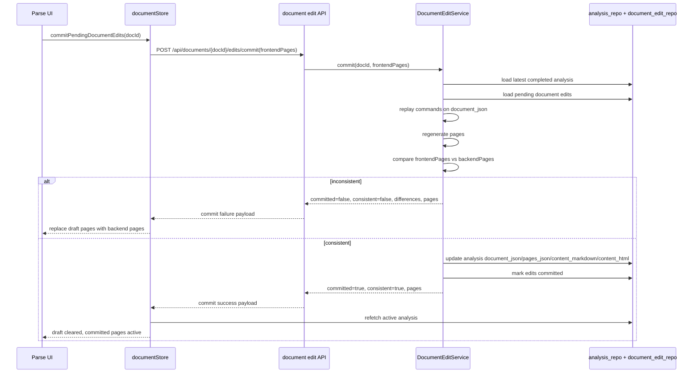
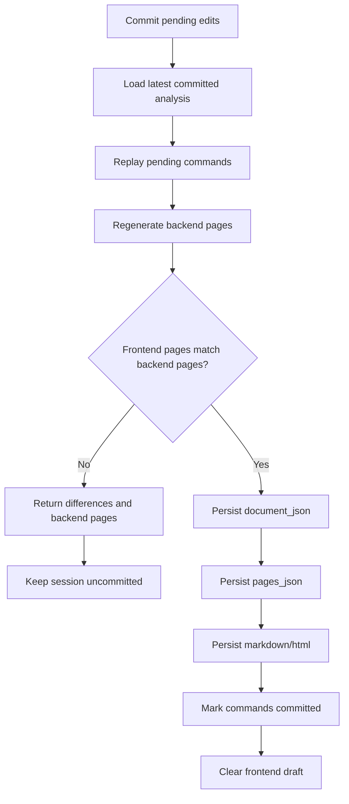

# Document Edit V1 Reference

- **Author:** OpenCode
- **Date:** 2026-05-29
- **Status:** Implemented (V1)
- **Scope:** Ref-stable page-element edits in the Parse workspace

---

## 1. What is implemented

The current document-edit feature supports optimistic page-element editing of existing Docling elements in the Parse workspace.

Implemented command set:

- `update_page_element`

Implemented session operations:

- load edit session
- queue page-element edit command
- commit pending commands
- discard pending commands

Implemented API routes:

- `GET /api/documents/{doc_id}/edits/session`
- `POST /api/documents/{doc_id}/edits/commands`
- `POST /api/documents/{doc_id}/edits/commit`
- `DELETE /api/documents/{doc_id}/edits/session`

## 2. Current command model

Backend action enum:

```python
class DocumentEditAction(StrEnum):
    UPDATE_PAGE_ELEMENT = "update_page_element"
```

Persisted command shape:

```json
{
  "id": "uuid",
  "analysisId": "analysis-uuid",
  "action": "update_page_element",
  "targetRef": "#/texts/12",
  "payload": {
    "content": "Updated content",
    "bbox": [10, 20, 110, 60],
    "type": "section_header"
  },
  "actor": "user",
  "at": "2026-05-29T12:34:56+00:00",
  "status": "pending"
}
```

Request shape sent to the unified command endpoint:

```json
{
  "commands": [
    {
      "action": "update_page_element",
      "targetRef": "#/texts/12",
      "payload": {
        "content": "Updated content",
        "bbox": [10, 20, 110, 60],
        "type": "section_header"
      }
    }
  ]
}
```

Semantics:

- `targetRef` points to an existing Docling item by `self_ref`
- `payload.content` replaces the item's current text when the item supports text
- `payload.bbox` updates the item's provenance bbox in frontend top-left coordinates
- `payload.type` updates the item's label only when the Docling item family safely supports that target type
- the command is append-only in `document_edits`
- pending commands are replayed from the latest committed `document_json`

## 3. What is not implemented yet

Not implemented in V1:

- `merge_texts`
- `reparent_item`
- insert/delete commands
- undo/redo
- optimistic tree regeneration during draft editing
- ref remapping after structural mutations

The main reason is `self_ref` stability. Structural Docling mutations can renumber refs, so V1 is intentionally limited to ref-stable field updates on existing elements.

## 4. Runtime flow

### 4.1 Load session

When the Parse workspace opens, the frontend loads the active analysis and then asks the backend for the current edit session. If pending commands exist, the backend replays them and returns the draft pages.



### 4.2 Queue page-element edit

The user edits content, bbox, or type in `ElementProperties.vue`. The frontend updates the selected page element immediately, then persists an `update_page_element` command to the backend through the unified command endpoint.



## 5. Commit flow

Commit uses the frontend draft pages as the optimistic expectation. The backend replays pending commands onto canonical `document_json`, regenerates pages, and compares the result before persisting.



## 6. Flow diagrams

### 6.1 High-level architecture


### 6.2 Commit decision flow



## 7. Files involved

Backend:

- `document-parser/domain/value_objects.py`
- `document-parser/domain/models.py`
- `document-parser/domain/ports.py`
- `document-parser/persistence/database.py`
- `document-parser/persistence/document_edit_repo.py`
- `document-parser/services/document_edit_service.py`
- `document-parser/api/schemas.py`
- `document-parser/api/document_edits.py`
- `document-parser/main.py`

Frontend:

- `frontend/src/shared/types.ts`
- `frontend/src/features/document/api.ts`
- `frontend/src/features/document/store.ts`
- `frontend/src/pages/DocParseTab.vue`
- `frontend/src/features/document/ui/ElementProperties.vue`
- `frontend/src/shared/i18n.ts`

## 8. Important design constraints

- `document_json` is the source of truth
- `pages_json` is derived output
- optimistic frontend state is allowed to be temporary
- backend replay is canonical
- commit must compare regenerated backend pages with frontend draft pages before persisting
- V1 is intentionally limited to ref-stable field edits to avoid `self_ref` renumbering problems from structural Docling edits

## 9. Extension path

Likely next commands:

1. `merge_texts`
2. `reparent_item`
3. insert/delete with ref remapping
4. undo/redo on top of the command log
5. broader type-family conversions if class replacement becomes necessary
