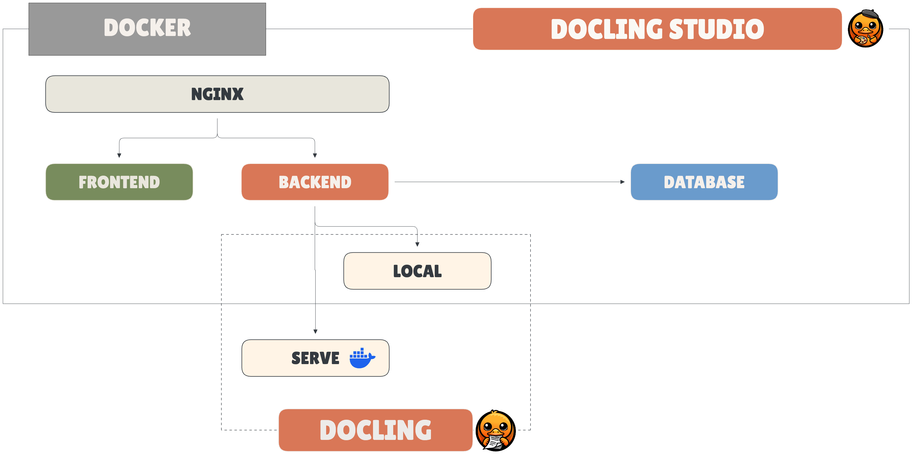

# Getting Started

## Quick Start

One command, nothing else to install:

```bash
docker run -p 3000:3000 ghcr.io/scub-france/docling-studio:latest-local
```

Open [http://localhost:3000](http://localhost:3000), upload a PDF, and get results. That's it.

!!! note
    The first analysis takes longer as Docling downloads its ML models (~400 MB). Subsequent runs are fast.

{ width="600" }

## Image Variants

| Variant | Image tag | Size | Description |
|---------|-----------|------|-------------|
| **local** | `latest-local` | ~1.9 GB | Full — runs Docling in-process, CPU-only |
| **remote** | `latest-remote` | ~270 MB | Lightweight — delegates to an external [Docling Serve](https://github.com/DS4SD/docling-serve) instance |

For remote mode:

```bash
docker run -p 3000:3000 \
  -e DOCLING_SERVE_URL=http://your-docling-serve:5001 \
  ghcr.io/scub-france/docling-studio:latest-remote
```

## Docker Compose

```bash
git clone https://github.com/scub-france/Docling-Studio.git
cd Docling-Studio

# Simple mode (backend + frontend only)
docker compose up --build

# With ingestion pipeline (OpenSearch + embeddings)
docker compose --profile ingestion \
  -f docker-compose.yml -f docker-compose.ingestion.yml \
  up --build
```

## Local Development

=== "Backend (Python 3.12+)"

    ```bash
    cd document-parser
    python -m venv .venv && source .venv/bin/activate

    # Remote mode (lightweight)
    pip install -r requirements.txt

    # Local mode (with Docling)
    pip install -r requirements-local.txt

    uvicorn main:app --reload --port 8000
    ```

=== "Frontend (Node 20+)"

    ```bash
    cd frontend
    npm install
    npm run dev
    ```

The frontend runs on `http://localhost:3000` and proxies API calls to `http://localhost:8000`.

## Running Tests

=== "Backend"

    ```bash
    cd document-parser
    pip install pytest pytest-asyncio httpx
    pytest tests/ -v
    ```

=== "Frontend"

    ```bash
    cd frontend
    npm run test:run
    ```

## Pipeline Options

These options map directly to Docling's [`PdfPipelineOptions`](https://docling-project.github.io/docling/usage/).

| Option | Default | Description |
|--------|---------|-------------|
| `do_ocr` | `true` | OCR for scanned pages and embedded images |
| `do_table_structure` | `true` | Table detection and row/column reconstruction |
| `table_mode` | `accurate` | `accurate` (TableFormer) or `fast` |
| `do_code_enrichment` | `false` | Specialized OCR for code blocks |
| `do_formula_enrichment` | `false` | Math formula recognition (LaTeX output) |
| `do_picture_classification` | `false` | Classify images by type |
| `do_picture_description` | `false` | Generate image descriptions via VLM |
| `generate_picture_images` | `false` | Extract detected images as separate files |
| `generate_page_images` | `false` | Rasterize each page as an image |
| `images_scale` | `1.0` | Scale factor for generated images (0.1–10) |

## Chunking Options

!!! note
    Chunking is only available in **local** mode. The chunking UI is hidden when using remote mode (Docling Serve).

After a document is analyzed, you can split the extracted content into semantic chunks. Chunking can be configured at analysis time or re-run later with different options via the **rechunk** action.

| Option | Default | Description |
|--------|---------|-------------|
| `chunker_type` | `hybrid` | `hybrid` (semantic + structural), `hierarchical` (heading-based), or `page` (one chunk per page) |
| `max_tokens` | `512` | Maximum tokens per chunk |
| `merge_peers` | `true` | Merge sibling elements under the same heading |
| `repeat_table_header` | `true` | Repeat table headers when a table is split across chunks |

Each chunk includes:

- **text** — the chunk content
- **headings** — heading hierarchy leading to the chunk
- **source_page** — the page number the chunk originates from
- **token_count** — number of tokens in the chunk
- **bboxes** — bounding boxes of the chunk's source elements (page + coordinates)

## Configuration

All configuration is done via environment variables:

| Variable | Default | Description |
|----------|---------|-------------|
| `CONVERSION_ENGINE` | `local` | `local` (in-process Docling) or `remote` (Docling Serve) |
| `DOCLING_SERVE_URL` | `http://localhost:5001` | Docling Serve endpoint (remote mode only) |
| `DOCLING_SERVE_API_KEY` | — | API key for Docling Serve (optional) |
| `CORS_ORIGINS` | `http://localhost:3000,...` | CORS allowed origins |
| `UPLOAD_DIR` | `./uploads` | File storage directory |
| `DB_PATH` | `./data/docling_studio.db` | SQLite database path |
| `CONVERSION_TIMEOUT` | `600` | Max seconds per Docling conversion |
| `BATCH_PAGE_SIZE` | `5` (Docker) / `0` | Pages per batch (`0` = process all at once) |
| `MAX_CONCURRENT_ANALYSES` | `3` | Maximum parallel analysis jobs |
| `DEPLOYMENT_MODE` | `self-hosted` | `self-hosted` or `huggingface` (shows disclaimer banner) |
| `MAX_FILE_SIZE_MB` | `50` | Maximum upload file size in MB (`0` = unlimited) |
| `MAX_PAGE_COUNT` | `0` | Maximum number of pages per document (`0` = unlimited) |
| `RATE_LIMIT_RPM` | `100` | Max requests per minute per IP (`0` = disabled) |
| `APP_VERSION` | `dev` | Application version (set automatically by CI/Docker) |

## Upload Limits

Docling Studio enforces configurable limits on uploaded documents to protect the server against oversized files and long-running analyses:

- **`MAX_FILE_SIZE_MB`** (default `50`) — rejects uploads exceeding this size. Validated at two levels: early `Content-Length` check and streaming byte count.
- **`MAX_PAGE_COUNT`** (default `0` = unlimited) — rejects documents with more pages than allowed. Useful on shared instances or Hugging Face Spaces to cap processing time.

Both limits are exposed in the `/api/health` endpoint so the frontend can display them to the user before upload. Set either to `0` to disable the corresponding check.

## Ingestion Pipeline (opt-in)

Docling Studio can optionally index extracted chunks into [OpenSearch](https://opensearch.org/) for vector and full-text search. This requires two additional services (OpenSearch + embedding) and is **disabled by default**.

To enable ingestion with Docker Compose:

```bash
docker compose --profile ingestion \
  -f docker-compose.yml -f docker-compose.ingestion.yml \
  up --build
```

When ingestion is enabled, the UI shows:

- An **Ingest** button in Studio to push chunks to OpenSearch
- An **OpenSearch** connection status badge in the sidebar
- **Indexed / Not indexed** filters on the Documents page
- A **Search** page for full-text and vector search across indexed documents

| Variable | Default | Description |
|----------|---------|-------------|
| `OPENSEARCH_URL` | — | OpenSearch endpoint (empty = ingestion disabled) |
| `EMBEDDING_URL` | — | Embedding service endpoint (empty = ingestion disabled) |
| `EMBEDDING_DIMENSION` | `384` | Vector dimension (must match embedding model) |

## System Requirements

| | Remote image | Local image |
|---|---|---|
| **Image size** | ~270 MB | ~1.9 GB |
| **Memory** | 2 GB | 6 GB (recommended 8 GB+) |
| **CPUs** | 2 | 4 (recommended 8+) |

All Docker images are multi-arch (`linux/amd64` + `linux/arm64`). No GPU required.
