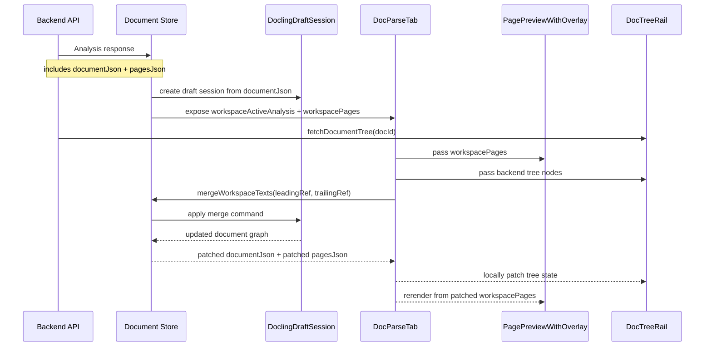
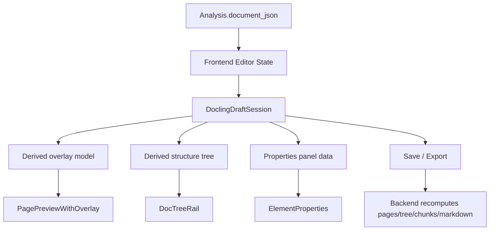

# Document Feature Architecture

This note explains how parsed-document data currently flows through the
document feature, why the frontend does not always use the full
`DoclingDocument`, and what the cleaner long-term shape would be.

## Short Answer

The frontend was originally built around backend projections of a parsed
document, not around a frontend-native Docling editor.

That means the UI mostly consumed:

- `pagesJson` for page overlays and bounding boxes
- `/api/documents/:id/tree` for the structure rail
- `chunksJson` and chunk APIs for chunk editing
- `contentMarkdown` / `contentHtml` for rendered content

The full `documentJson` was persisted on the backend, but the frontend did not
always need it.

Once local editing was introduced, the frontend started needing the raw
`DoclingDocument` too. The current architecture is therefore mixed: it uses
both the canonical document graph and several backend-derived projections.

## Main Representations

### 1. Full Docling graph: `documentJson`

This is the serialized `DoclingDocument`.

It contains the richest data model:

- document body/group/text hierarchy
- `self_ref` identifiers
- parent/child references
- provenance
- labels and content
- non-text Docling items

This is the best source of truth for editing.

### 2. Overlay projection: `pagesJson`

This is a backend-built page-oriented projection used by the preview canvas.

It is optimized for drawing overlays quickly and contains flat page elements
with fields like:

- `bbox`
- `content`
- `type`
- `self_ref`

This is convenient for rendering, but it is not the full document graph.

### 3. Structure projection: `/api/documents/:id/tree`

This is another backend-built projection, optimized for the left tree rail.

It already contains UI-friendly nesting and display labels, so the frontend can
render the structure view without rebuilding Docling semantics itself.

### 4. Chunk projection: `chunksJson` and chunk APIs

This is optimized for chunk workflows, not for raw Docling editing.

It is related to the same parsed document, but it is a different working view
with its own behavior and persistence rules.

## Current Architecture

```mermaid
flowchart TD
    A[Backend Analysis Row] --> B[document_json]
    A --> C[pages_json]
    A --> D[content_markdown / content_html]
    A --> E[chunks_json]

    B --> F[Frontend DoclingDraftSession]
    C --> G[PagePreviewWithOverlay]
    D --> H[Rendered analysis content]
    E --> I[Chunk workflows]

    J[/api/documents/:id/tree] --> K[DocTreeRail]

    F --> L[Local edit operations\nmerge / split / move / delete]
    L --> M[Locally patched analysis state]
    M --> G
    M --> K
```

## Why The Frontend Does Not Always Use `documentJson`

Because the system did not start as a frontend Docling editor.

It started as a UI consuming backend-shaped data for specific jobs:

- drawing bboxes
- showing a structure tree
- editing chunks
- rendering extracted content

For those jobs, the full Docling graph was more than the frontend needed.
Using smaller derived payloads kept the frontend simpler and let the backend own
projection logic.

## Why This Starts To Feel Wrong During Editing

As soon as the frontend performs local document edits, the split between
canonical graph and derived projections becomes visible.

The frontend now has to keep several views aligned:

- `documentJson` for the actual edit
- `pagesJson` for overlays
- tree state for the structure rail
- chunk-related state separately

That creates architectural tension because only one of those is truly the full
document model.

## Current Parse-Workspace Flow



## What Is Canonical Today?

Today there are effectively two categories of truth:

### Canonical persisted source

- backend `Analysis.document_json`

### Runtime UI projections

- `pagesJson`
- tree response
- chunk projections
- markdown/html

During local editing, the frontend mutates a working `documentJson` draft and
then patches some projections locally. That works, but it is not yet a fully
unified model.

## Recommended Target Architecture

If frontend-side Docling editing becomes a real feature, the cleaner design is:

1. use `documentJson` as the parse-workspace source of truth
2. derive overlay elements from it in the frontend
3. derive tree nodes from it in the frontend
4. treat backend projections as initial-load helpers or persistence outputs
5. regenerate backend projections on save, not on every local interaction



## Why We Have Not Fully Moved There Yet

Because several backend projections currently contain logic the frontend does
not yet own:

- tree shaping and display labeling
- page-overlay shaping
- markdown/html export
- chunk regeneration rules

So the current implementation is an incremental transition, not a completed
unification.

## Practical Rule Of Thumb

For the current codebase:

- use `documentJson` when you need semantic document editing
- use `pagesJson` when you need fast page overlays
- use tree API results when you need the structure rail as it exists today
- expect some patching/synchronization glue until the parse workspace is fully
  Docling-driven

## Recommendation

If this feature continues to grow, the next architectural step should be to
move tree derivation and overlay derivation behind frontend functions that take
`documentJson` as input. That would make the parse workspace far easier to
reason about and would remove much of the current projection drift risk.
